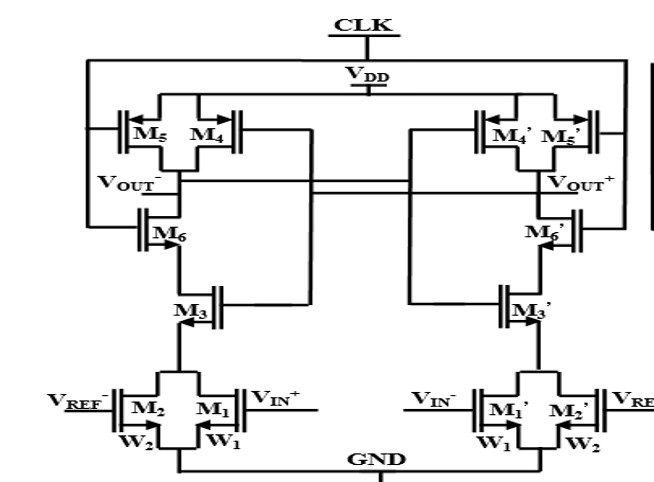
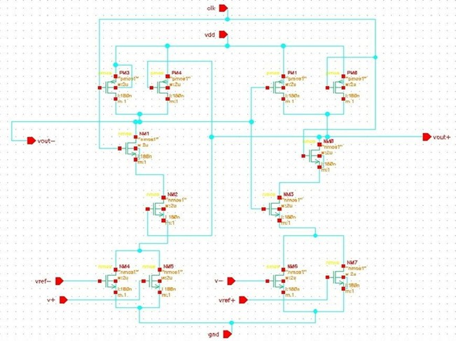
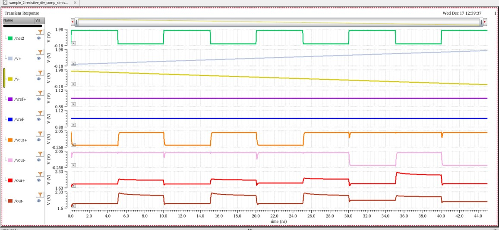
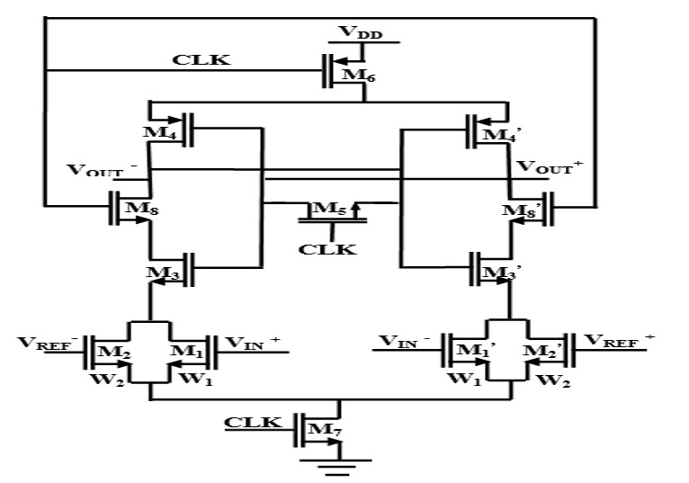
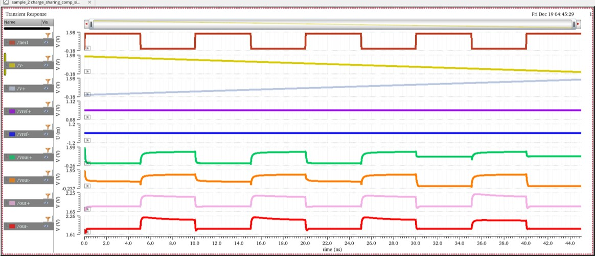

# Regenerative Latch Comparator for Flash ADC

## Overview

This project presents the design and simulation of comparator architectures for
high-speed Analog-to-Digital Converter (ADC) applications. Multiple static and
dynamic comparator topologies are analyzed, compared, and evaluated for use in a
Flash ADC. Based on the comparison, the Strong-Arm Latch Comparator is selected
and integrated into the ADC architecture.

The project covers comparator design, circuit-level implementation, simulation,
performance comparison, Flash ADC subsystem design, and ADC output verification.

## Table of Contents

- [Objectives](#objectives)
- [Project Workflow](#project-workflow)
- [Comparator Architectures](#comparator-architectures)
- [Comparator Comparison Summary](#comparator-comparison-summary)
- [Flash ADC Design Flow](#flash-adc-design-flow)
- [Tools Used](#tools-used)
- [Repository Structure](#repository-structure)
- [Conclusion](#conclusion)

## Objectives

- Study different comparator architectures used in ADC systems.
- Compare static and dynamic comparator designs.
- Analyze regenerative latch behavior.
- Implement and simulate a Strong-Arm Latch Comparator.
- Design a Flash ADC using the selected comparator architecture.
- Verify ADC functionality through simulation.

## Project Workflow

1. Study comparator architectures.
2. Design comparator circuits.
3. Simulate and verify individual comparator performance.
4. Compare power, offset, and delay values.
5. Select the most suitable comparator for Flash ADC design.
6. Design ADC subsystems.
7. Integrate the complete Flash ADC.
8. Verify analog-to-digital conversion output.

## Comparator Architectures

Each comparator architecture is documented using the following structure:

- Block diagram
- Circuit schematic
- Simulation result
- Working principle
- Observed result

### 1. Resistive Divider Comparator

#### Block Diagram



#### Schematic



#### Simulation Result



#### Working Principle

The resistive divider comparator generates a reference voltage using a resistor
network. The input signal is compared with this reference voltage, and the output
switches according to the input-to-reference voltage difference.

#### Result

- Performs successful threshold detection.
- Uses a simple circuit architecture.
- Has higher static power consumption due to the resistor network.

### 2. Charge Sharing Comparator

#### Block Diagram



#### Schematic


#### Simulation Result



#### Working Principle

The charge sharing comparator uses capacitor charge redistribution to compare
the input voltage with the reference voltage.

#### Result

- Reduces static power consumption.
- Provides faster operation than resistive implementations.
- Is sensitive to capacitor mismatch.

### 3. Latch Dynamic Comparator

The comparator folders are summarized below for quick access:

| No. | Comparator Architecture |
|-----|-------------------------|
| 1 | [Resistive Divider Comparator](Design/01-Comparators/01-Resistive-DIvider-Comparator/) |
| 2 | [Charge Sharing Comparator](Design/01-Comparators/02-Charge-Sharing-Comparator/) |
| 3 | [Latch Dynamic Comparator](Design/01-Comparators/03-Latch-Dynamic-Comparator/) |
| 4 | [Offset Compensated Comparator](Design/01-Comparators/04-Offset-Compensated-Comparator/) |
| 5 | [Strong-Arm Latch Comparator](Design/01-Comparators/05-Strong-Arm-Latch-Comparator/) |
| 6 | [Low Power Dynamic Comparator](Design/01-Comparators/06-Low-Power-Dynamic-Comparator/) |
| 7 | [Three Stage Dynamic Comparator](Design/01-Comparators/07-Three-Stage-Dynamic-Comparator/) |
| 8 | [Two Stage Dynamic Comparator](Design/01-Comparators/08-Two-Stage-Dynamic-Comparator/) |
| 9 | [Single Tail Comparator](Design/01-Comparators/09-Single-Tail-Comparator/) |
| 10 | [Elzakker Comparator](Design/01-Comparators/10-Elzakker-Comparator/) |
| 11 | [Modified Strong-Arm Latch Comparator](Design/01-Comparators/11-Modified-Strong-Arm-Latch-Comparator/) |
| 12 | [Voltage Sense Amplifier Comparator](Design/01-Comparators/12-Voltage-Sense-Amplifier-Comparator/) |
| 13 | [PMOS Preamplifier Comparator](Design/01-Comparators/13-PMOS-Preamplifier-Comparator/) |
| 14 | [Dual Rail Double Tail Comparator](Design/01-Comparators/14-Dual-Rail-Double-Tail-Comparator/) |

## Comparator Comparison Summary

| Comparator | Author(s) | Power (W) | Offset (V) | Delay (s) |
|------------|-----------|-----------|------------|-----------|
| Resistive Divider Comparator | Lauri Sumanen et al. | 13.98 u | 192.4 m | 39.66 n |
| Charge Sharing Comparator | D. Meganathan et al. | 6.92 u | 193.5 m | 120.8 p |
| Latch Dynamic Comparator | C.-P. Huang et al. | 32.46 u | 206 m | 30.08 n |
| Offset Compensated Comparator | Fei Yuvan | 31.29 u | 105 m | 16.63 n |
| Strong-Arm Latch Comparator | L. Filippini, B. Taskin | 12.56 u | 189.2 m | 77.72 p |
| Low Power Dynamic Comparator | Subhash Chevella et al. | 22.34 u | 185.8 m | 30.2 n |
| Three Stage Comparator | Z. Li et al. | 32.215 u | 212 m | 94.08 p |
| Two Stage Comparator | Y. Wang et al. | 51.675 u | 204 m | 30.08 n |
| Elzakker Comparator | Z. Li et al. | 13.546 u | 209.6 m | 30.11 n |
| Modified Strong-Arm Comparator | Maria R. Siukaeva et al. | 8.6929 u | 206.7 m | 51.87 p |
| Voltage Sense Amplifier Comparator | Dinanath N. Donadkar et al. | 14.9016 u | 207.2 m | 30.1 n |
| PMOS Preamplifier Comparator | Maria R. Siukaeva et al. | 15.57 u | 205.9 m | 4.137 n |
| Dual Rail Double Tail Comparator | Dinanath N. Donadkar et al. | 31.6 u | 123.9 m | 139.3 p |

> Note: Unit prefixes are written as ASCII text for compatibility. For example,
> `u` represents micro, `m` represents milli, `n` represents nano, and `p`
> represents pico.

## Flash ADC Design Flow

The Flash ADC is designed using the Strong-Arm Latch Comparator because of its
high-speed operation and low power consumption.

### Step 1: Sample and Hold Circuit

#### Block Diagram


#### Schematic


#### Simulation Result


#### Function

The sample and hold circuit samples the analog input and maintains a constant
voltage during ADC conversion.

### Step 2: Strong-Arm Latch Comparator

#### Block Diagram


#### Schematic


#### Simulation Result


#### Function

The comparator compares the sampled voltage against reference ladder voltages
and generates thermometer-code outputs.

### Step 3: Priority Encoder

#### Block Diagram


#### Schematic


#### Simulation Result


#### Function

The priority encoder converts the thermometer code generated by the comparator
array into binary output.

### Step 4: Flash ADC Integration

#### Block Diagram


#### Schematic


#### Simulation Result


#### Result

The Flash ADC successfully converts analog input signals into digital output
codes. The use of regenerative latch comparators enables high-speed operation
with reduced power consumption.

## Tools Used

- Cadence Virtuoso
- CMOS analog design techniques
- Comparator design and simulation flow
- Flash ADC architecture

## Repository Structure

```text
.
|-- Design/
|   |-- 01-Comparators/
|   |-- 02-ADC/
|-- Report/
|-- Result/
|-- README.md
```

## Conclusion

Fourteen comparator architectures were designed and simulated to study their
operating principles, speed, power consumption, offset, and suitability for ADC
applications. From the comparison, the Strong-Arm Latch Comparator was selected
and integrated into a Flash ADC architecture. Simulation results verify
successful comparator operation and analog-to-digital conversion functionality.
