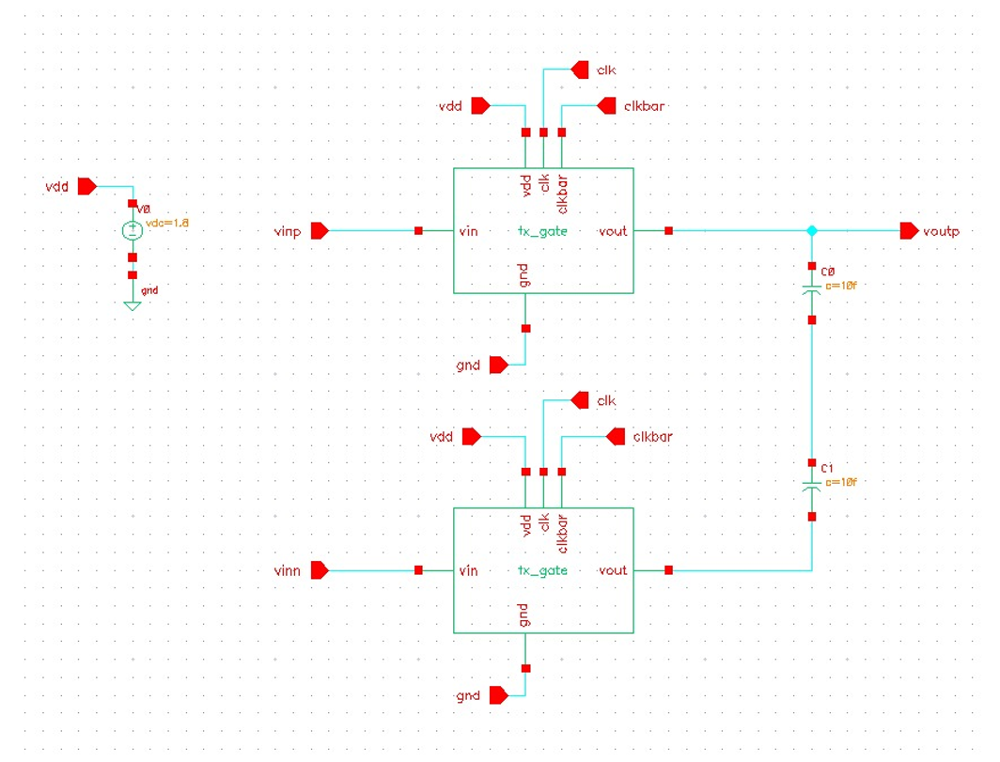
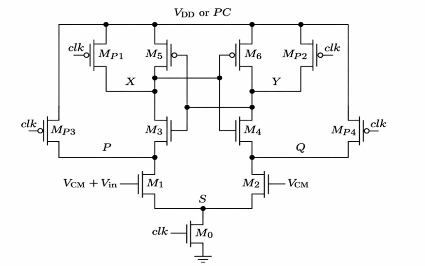
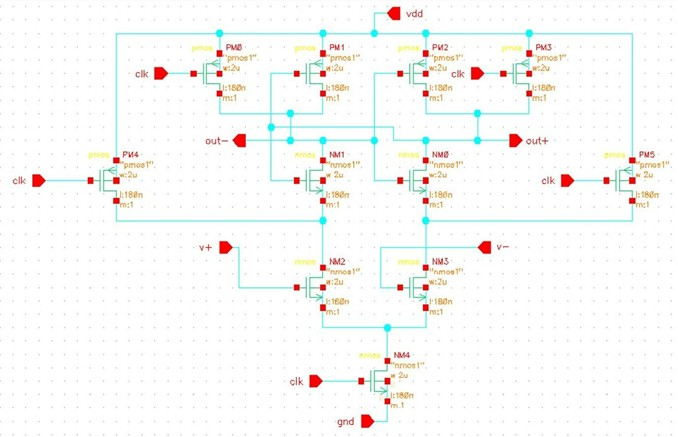
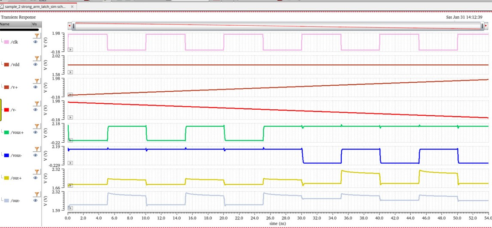
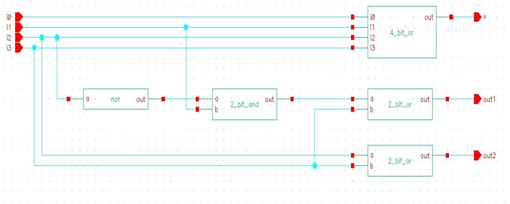
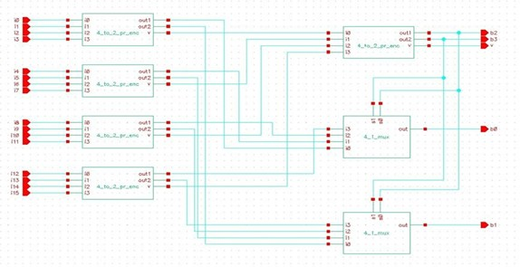
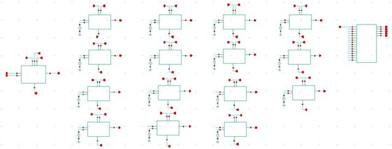
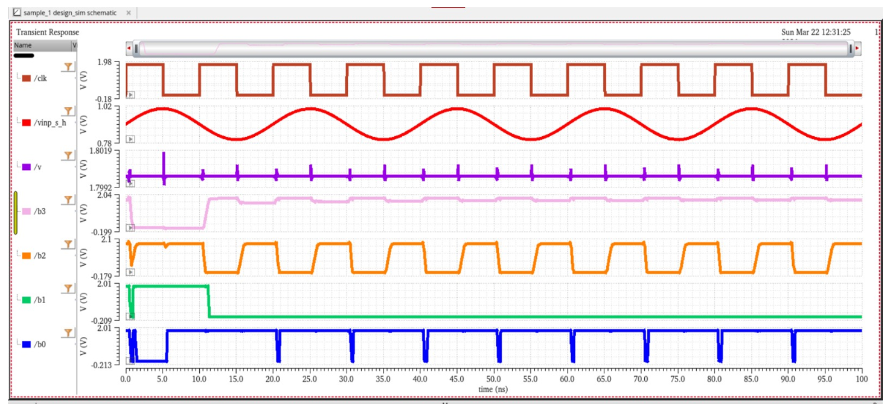

# Regenerative Latch Comparator for Flash ADC

## Overview

This project explores the design and simulation of multiple comparator architectures used in high-speed Analog-to-Digital Converters (ADCs). The study evaluates different comparator topologies and integrates the Strong-Arm Latch Comparator into a Flash ADC architecture.

The complete design flow includes:

* Comparator architecture analysis
* Circuit-level implementation
* Simulation and performance verification
* Flash ADC subsystem development
* ADC output validation

---

## Objectives

* Study various comparator architectures.
* Compare static and dynamic comparator designs.
* Analyze regenerative latch behavior.
* Implement a Strong-Arm Latch Comparator.
* Design a Flash ADC using the selected comparator.
* Verify ADC operation through simulation.

---

## Comparison of Performance Metrics of Various Comparator Architectures

| Comparator                         | Author(s)                   | Power (W) | Offset (V) | Delay (s) |
| ---------------------------------- | --------------------------- | --------- | ---------- | --------- |
| Resistive Divider Comparator       | Lauri Sumanen et al.        | 13.98µ    | 192.4m     | 39.66n    |
| Charge Sharing Comparator          | D. Meganathan et al.        | 6.92µ     | 193.5m     | 120.8p    |
| Latch Dynamic Comparator           | C.-P. Huang et al.          | 32.46µ    | 206m       | 30.08n    |
| Offset Compensated Comparator      | Fei Yuvan                   | 31.29µ    | 105m       | 16.63n    |
| StrongARM Latch Comparator         | L. Filippini, B. Taskin     | 12.56µ    | 189.2m     | 77.72p    |
| Low Power Dynamic Comparator       | Subhash Chevella et al.     | 22.34µ    | 185.8m     | 30.2n     |
| Three Stage Comparator             | Z. Li et al.                | 32.215µ   | 212m       | 94.08p    |
| Two Stage Comparator               | Y. Wang et al.              | 51.675µ   | 204m       | 30.08n    |
| Elzakker Comparator                | Z. Li et al.                | 13.546µ   | 209.6m     | 30.11n    |
| Modified StrongARM Comparator      | Maria R. Siukaeva et al.    | 8.6929µ   | 206.7m     | 51.87p    |
| Voltage Sense Amplifier Comparator | Dinanath N. Donadkar et al. | 14.9016µ  | 207.2m     | 30.1n     |
| PMOS Preamplifier Comparator       | Maria R. Siukaeva et al.    | 15.57µ    | 205.9m     | 4.137n    |
| Dual Rail Double Tail Comparator   | Dinanath N. Donadkar et al. | 31.6µ     | 123.9m     | 139.3p    |

---

# ADC Design Flow

The Flash ADC was designed using the StrongARM Latch Comparator due to its high speed, low power consumption, and regenerative feedback mechanism. The ADC implementation consists of four major stages:

1. Sample and Hold Circuit
2. StrongARM Latch Comparator
3. Priority Encoder
4. Flash ADC Integration

---

## Step 1: Sample and Hold Circuit

### Schematic

### Function

The Sample-and-Hold circuit samples the analog input signal during the sampling phase and maintains the sampled voltage during the conversion phase. This ensures that the comparator array operates on a stable input voltage.

### Result

The circuit successfully captures and holds the analog input voltage for subsequent processing by the comparator stage.

---

## Step 2: StrongARM Latch Comparator

### Block Diagram

### Schematic

### Simulation

### Function

The StrongARM latch comparator compares the sampled input voltage against reference voltages generated by the resistor ladder. Positive feedback inside the regenerative latch rapidly amplifies small voltage differences, producing a digital output.

### Result

The comparator achieves high-speed decision making with low power consumption, making it suitable for Flash ADC applications.

---

## Step 3: Priority Encoder

### Schematics

#### 4-to-2 Priority Encoder

#### 16-to-4 Priority Encoder

### Function

The priority encoder converts the thermometer-code outputs generated by the comparator array into an equivalent binary code. This significantly reduces the number of output bits required for digital representation.

### Result

Successful conversion of comparator outputs into binary codes suitable for digital processing.

---

## Step 4: 4-Bit Flash ADC

### Schematic

### Simulation Result

### Function

The Flash ADC combines the Sample-and-Hold circuit, comparator array, reference ladder network, and priority encoder into a complete analog-to-digital conversion system.

### Result

The 4-bit Flash ADC successfully converts analog input voltages into corresponding digital output codes with high-speed operation. The StrongARM latch comparator provides fast comparison while maintaining low power consumption, enabling efficient ADC performance.

---

## ADC Design Summary

| Stage                | Purpose                                        |
| -------------------- | ---------------------------------------------- |
| Sample & Hold        | Captures and maintains input voltage           |
| StrongARM Comparator | Compares input against reference voltages      |
| Priority Encoder     | Converts thermometer code to binary            |
| Flash ADC            | Performs complete analog-to-digital conversion |

The successful integration of these building blocks demonstrates the implementation of a high-speed 4-bit Flash ADC using regenerative latch comparator architecture.
